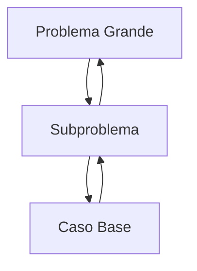

# Recursividad en TypeScript

Bienvenido a este repositorio educativo diseñado para aprender **Recursividad** desde cero hasta un nivel avanzado, utilizando **TypeScript**.

## 📚 Tabla de Contenidos

1. [Introducción](#introducción)
2. [Conceptos Básicos](conceptos/)
3. [Ejemplos](ejemplos/)
4. [Ejercicios](ejercicios/)
5. [Soluciones](soluciones/)
6. [Cómo Ejecutar](como-ejecutar)

## 🚀 Introducción <a name="introducción"></a>

La recursividad es una técnica fundamental en programación donde una función se llama a sí misma para resolver problemas complejos dividiéndolos en subproblemas más simples.



## 🛠️ Cómo Ejecutar

Este proyecto utiliza **TypeScript** y **pnpm**.

### Prerrequisitos

- Node.js
- pnpm

### Instalación

```bash
pnpm install
```

### Compilación

Para verificar que todo el código es correcto:

```bash
pnpm build
```

### Ejecutar un Ejemplo

Puedes ejecutar cualquier archivo `.ts` usando `ts-node` (si lo instalas) o compilando y ejecutando con `node`.

```bash
# Opción recomendada: compilar y ejecutar
pnpm build
node dist/ejemplos/factorial.js
```

## 🤝 Contribuciones

¡Las contribuciones son bienvenidas! Si encuentras un error o quieres agregar un nuevo ejemplo:

1. Haz un Fork del repositorio.
2. Crea una rama (`git checkout -b feature/nuevo-ejemplo`).
3. Haz tus cambios y commit (`git commit -m 'Agrega nuevo ejemplo'`).
4. Push a la rama (`git push origin feature/nuevo-ejemplo`).
5. Abre un Pull Request.
