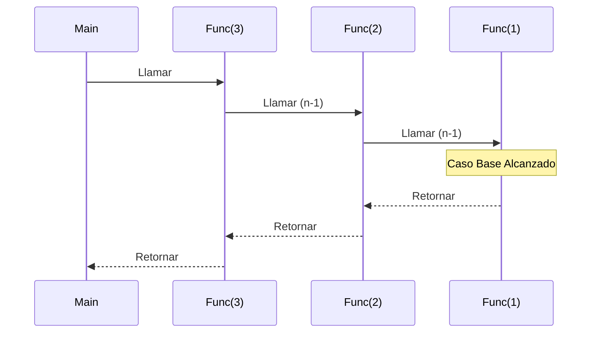

# Casos Base

El **caso base** es la condición que detiene la recursividad. Sin él, la función se llamaría a sí misma infinitamente, provocando un desbordamiento de pila (Stack Overflow).

## ¿Por qué es importante?

Es la "salida" de la función. Define el problema más simple que se puede resolver directamente sin hacer más llamadas recursivas.

## Analogía

Si estás subiendo una escalera, el caso base es llegar al último escalón. Si no te detienes ahí, intentarás subir un escalón que no existe y te caerás.

## Diagrama



## Ejemplo: Factorial

El factorial de 0 es 1. Este es nuestro caso base.

```typescript
function factorial(n: number): number {
  // Caso Base
  if (n === 0) {
    return 1;
  }

  // Paso Recursivo
  return n * factorial(n - 1);
}
```
