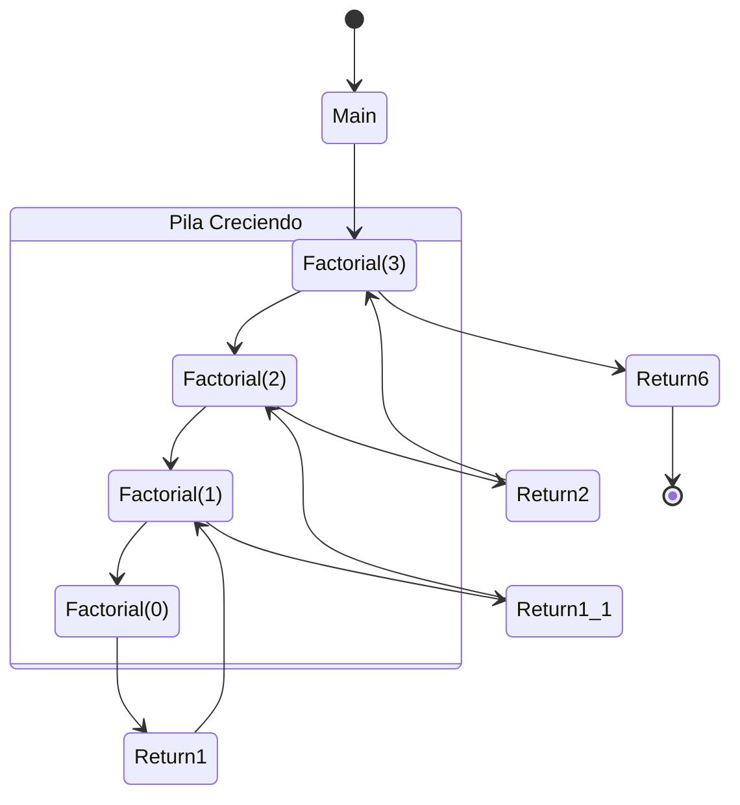

# Pila de Llamadas (Call Stack)

La **pila de llamadas** es una estructura de datos que el motor de JavaScript (y otros lenguajes) usa para gestionar las llamadas a funciones.

## ¿Cómo funciona?

1. Cuando invocas una función, se añade (push) a la parte superior de la pila.
2. Cuando la función termina, se elimina (pop) de la pila.
3. Si una función llama a otra, la nueva se coloca encima de la anterior.

## Visualización

Imagina una pila de platos. Solo puedes poner un plato encima del último y solo puedes quitar el de arriba.

## Diagrama en Recursividad

## Importancia

Entender la pila es crucial para entender cómo la recursividad "recuerda" el estado anterior cuando regresa de una llamada recursiva.
