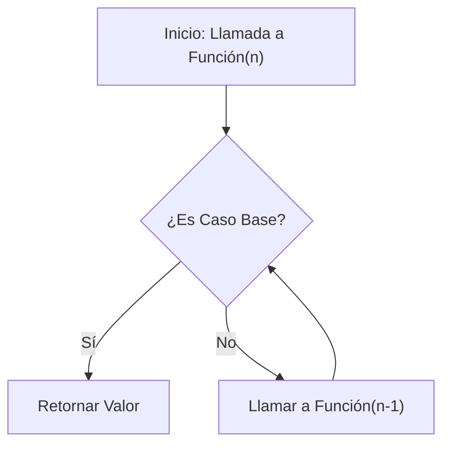

# ¿Qué es la Recursividad?

La recursividad es una técnica de programación donde una función se llama a sí misma para resolver un problema.

Imagina que quieres abrir una caja fuerte que contiene otra caja fuerte, y esa otra, hasta encontrar una llave. La acción de "abrir caja" se repite hasta llegar al final.

## Concepto Clave

En lugar de usar un bucle (`for` o `while`) para repetir una tarea, la función se invoca a sí misma con una versión más pequeña del problema original.

## Diagrama de Flujo



## Ejemplo Simple

```typescript
function cuentaRegresiva(n: number): void {
  // Caso Base: detener la recursión
  if (n <= 0) {
    console.log("¡Despegue!");
    return;
  }

  console.log(n);
  // Llamada Recursiva
  cuentaRegresiva(n - 1);
}

cuentaRegresiva(3);
// Salida:
// 3
// 2
// 1
// ¡Despegue!
```
