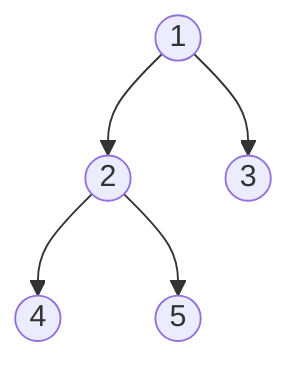
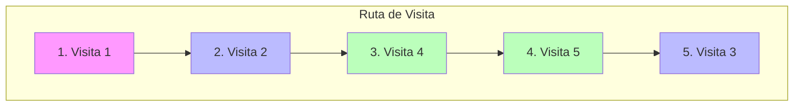
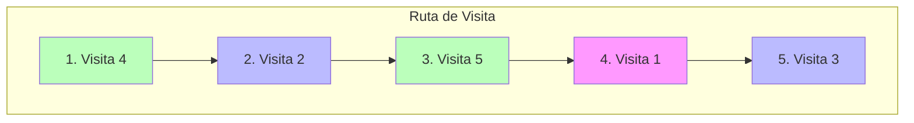
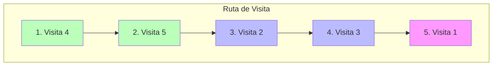

# Recorridos de Árboles Binarios

Un recorrido de árbol es el proceso de visitar cada nodo de una estructura de datos de árbol exactamente una vez.

## Árbol de Ejemplo

Usaremos el siguiente árbol binario para los ejemplos:

## 1. Preorder (Pre-orden)

**Orden**: Raíz → Izquierda → Derecha

1. Visitar **Raíz**.
2. Recorrer subárbol **Izquierdo**.
3. Recorrer subárbol **Derecho**.

**Resultado**: `[1, 2, 4, 5, 3]`

---

## 2. Inorder (En-orden)

**Orden**: Izquierda → Raíz → Derecha

1. Recorrer subárbol **Izquierdo**.
2. Visitar **Raíz**.
3. Recorrer subárbol **Derecho**.

**Resultado**: `[4, 2, 5, 1, 3]`

---

## 3. Postorder (Post-orden)

**Orden**: Izquierda → Derecha → Raíz

1. Recorrer subárbol **Izquierdo**.
2. Recorrer subárbol **Derecho**.
3. Visitar **Raíz**.

**Resultado**: `[4, 5, 2, 3, 1]`
