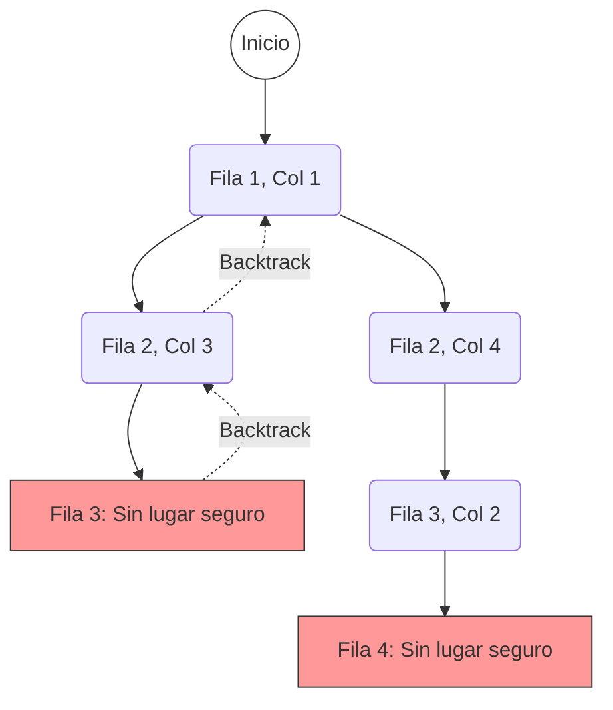

# Problema de las N-Reinas (N-Queens)

El objetivo es colocar $N$ reinas en un tablero de ajedrez de $N \times N$ de forma que ninguna reina pueda atacar a otra. Esto significa que no pueden compartir la misma fila, columna o diagonal.

## Visualización del Backtracking (N=4)

El algoritmo intenta colocar una reina fila por fila. Si encuentra un conflicto, retrocede (backtrack) y prueba la siguiente posición.



_Nota: El diagrama muestra solo una rama del árbol de decisión donde ocurren conflictos y retrocesos._

## Solución Válida para N=4

Una de las soluciones encontradas:

| .   | Q   | .   | .   |
| --- | --- | --- | --- |
| .   | .   | .   | Q   |
| Q   | .   | .   | .   |
| .   | .   | Q   | .   |

## Código Principal

```typescript
function backtrack(row: number) {
  // Caso Base: Todas las reinas colocadas
  if (row === n) {
    solutions.push(board.map((r) => r.join("")));
    return;
  }

  for (let col = 0; col < n; col++) {
    if (isSafe(row, col)) {
      board[row][col] = "Q"; // Colocar
      backtrack(row + 1); // Avanzar
      board[row][col] = "."; // Backtrack (Quitar)
    }
  }
}
```
