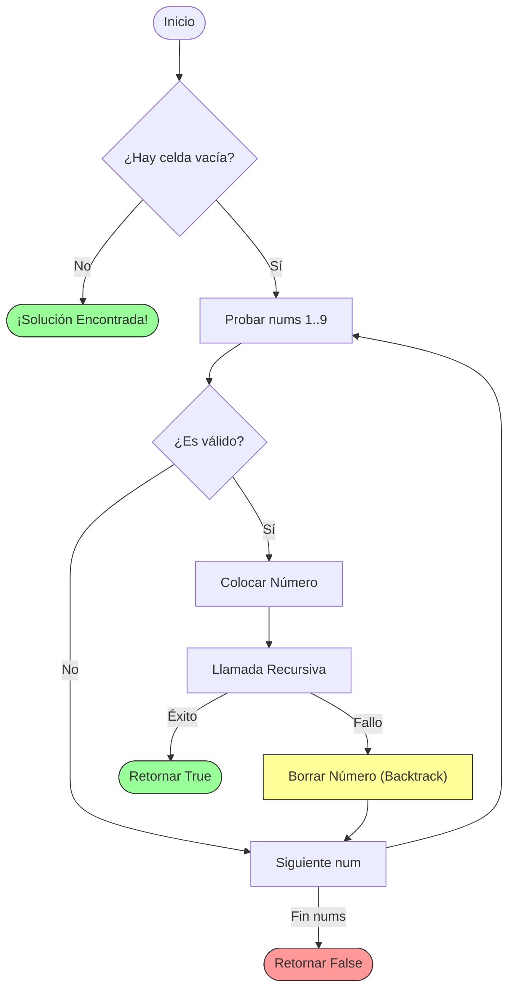

# Sudoku Solver

El algoritmo resuelve un tablero de Sudoku de 9x9 rellenando las celdas vacías. Utiliza **Backtracking** para probar números del 1 al 9 y retrocede si llega a un estado inválido.

## Lógica del Algoritmo

1. Buscar una celda vacía.
2. Intentar colocar un número (1-9).
3. Verificar si es válido (no existe en fila, columna o subcuadrícula 3x3).
4. Si es válido, colocarlo y llamar recursivamente para la siguiente celda.
5. Si la llamada recursiva falla (devuelve false), borrar el número (backtrack) y probar el siguiente.

## Diagrama de Flujo Simplificado



## Código Clave

```typescript
if (board[row][col] === ".") {
  for (let num = 1; num <= 9; num++) {
    if (isValid(board, row, col, num.toString())) {
      board[row][col] = num.toString(); // Colocar

      if (solveSudoku(board)) return true; // Si lleva a solución

      board[row][col] = "."; // Backtrack
    }
  }
  return false; // Sin solución por este camino
}
```
