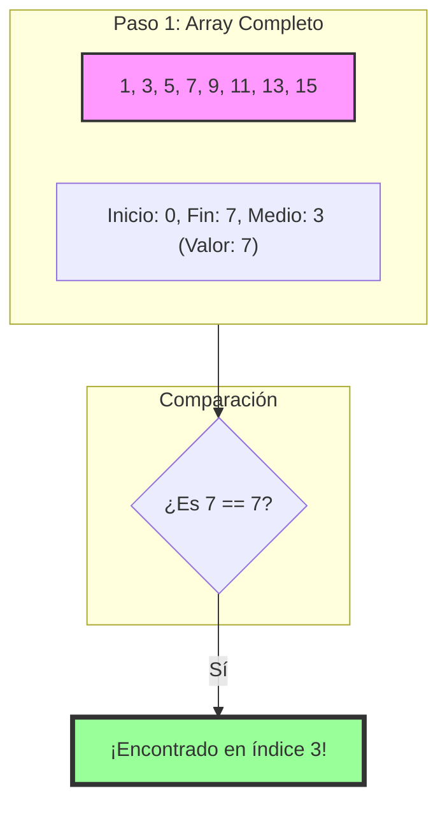
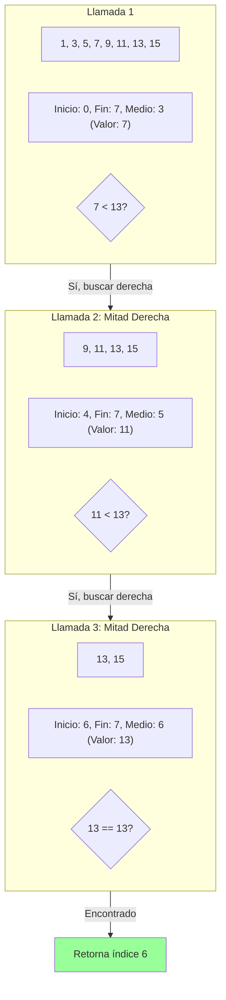

# Búsqueda Binaria (Binary Search)

La búsqueda binaria es un algoritmo eficiente para encontrar un elemento en una lista ordenada. Funciona dividiendo repetidamente el espacio de búsqueda a la mitad.

## Visualización del Proceso

Supongamos que buscamos el número **7** en el array `[1, 3, 5, 7, 9, 11, 13, 15]`.



### Otro caso: Buscando el 13

Si buscáramos el **13**:



## Código

```typescript
export function binarySearch(
  arr: number[],
  target: number,
  inicio: number = 0,
  fin: number = arr.length - 1
): number {
  if (inicio > fin) return -1;
  const medio = Math.floor((inicio + fin) / 2);
  if (arr[medio] === target) return medio;
  if (arr[medio] > target) return binarySearch(arr, target, inicio, medio - 1);
  return binarySearch(arr, target, medio + 1, fin);
}
```
