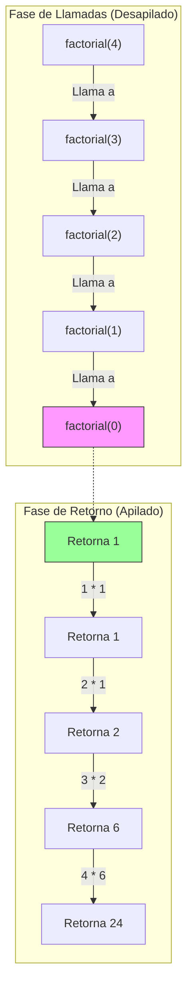

# Factorial

El factorial de un número entero no negativo $n$, denotado como $n!$, es el producto de todos los enteros positivos menores o iguales a $n$.

Definición recursiva:

- **Caso Base**: $0! = 1$
- **Caso Recursivo**: $n! = n \times (n-1)!$

## Visualización del Proceso (Factorial de 4)

Calculando `factorial(4)`:



## Código

```typescript
export function factorial(n: number): number {
  if (n < 0)
    throw new Error("El factorial no está definido para números negativos");

  // Caso Base
  if (n === 0) {
    return 1;
  }

  // Llamada Recursiva
  return n * factorial(n - 1);
}
```
