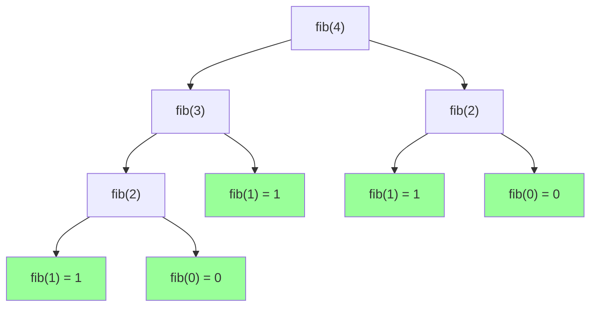

# Sucesión de Fibonacci

La sucesión de Fibonacci es una serie infinita de números naturales donde cada término es la suma de los dos anteriores.

Definición recursiva:

- **Casos Base**: $F(0) = 0$, $F(1) = 1$
- **Caso Recursivo**: $F(n) = F(n-1) + F(n-2)$

## Visualización del Árbol de Llamadas (Fibonacci de 4)

Observa cómo se ramifican las llamadas y cómo se repiten cálculos (por ejemplo, `fib(2)` se calcula varias veces).



## Código

```typescript
export function fibonacci(n: number): number {
  if (n < 0) throw new Error("No definido para números negativos");

  // Casos Base
  if (n === 0) return 0;
  if (n === 1) return 1;

  // Llamada Recursiva (doble)
  return fibonacci(n - 1) + fibonacci(n - 2);
}
```
