# Suma de Array (Recursiva)

Podemos sumar los elementos de un array pensando en la estructura de la lista:

- **Cabeza (Head)**: El primer elemento.
- **Cola (Tail)**: El resto del array.

La suma es: `head + suma(tail)`.

## Visualización del Proceso

Sumando el array `[1, 2, 3]`.

```mermaid
graph LR
    subgraph Paso1 ["Llamada 1"]
        Arr1["Array: 1, 2, 3"]
        Op1["1 + suma(2, 3)"]
    end

    subgraph Paso2 ["Llamada 2"]
        Arr2["Array: 2, 3"]
        Op2["2 + suma(3)"]
    end

    subgraph Paso3 ["Llamada 3"]
        Arr3["Array: 3"]
        Op3["3 + suma([])"]
    end

    subgraph Paso4 ["Caso Base"]
        Arr4["Array: []"]
        Ret4["Retorna 0"]
    end

    Paso1 --> Paso2
    Paso2 --> Paso3
    Paso3 --> Paso4

    Paso4 -.->|0| Paso3
    Paso3 -.->|"3 + 0 = 3"| Paso2
    Paso2 -.->|"2 + 3 = 5"| Paso1
    Paso1 -.->|"1 + 5 = 6"| Final["Resultado: 6"]

    style Ret4 fill:#9f9
    style Final fill:#9f9,stroke-width:4px
```



## Código

```typescript
export function sumaArray(arr: number[]): number {
  // Caso Base: Array vacío
  if (arr.length === 0) {
    return 0;
  }

  // Desestructuración: head (primero) y tail (resto)
  const [head, ...tail] = arr;

  // Llamada Recursiva
  return head + sumaArray(tail);
}
```
